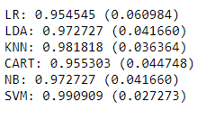
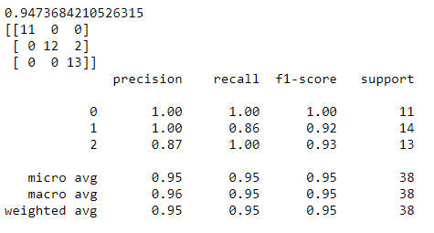

# ML-Algos-Introduction
## Dataset
Iris Dataset is taken from sklearn
## About Dataset
The Iris database, first used by Sir R.A. Fisher. The dataset is taken
from Fisher's paper. Note that it's the same as in R, but not as in the UCI
Machine Learning Repository, which has two wrong data points.
## Data Pre-processing
We split our data set into 2 parts: Training set and Validation set with the percentages of 75% - 25% respectively
## Modeling
We will use a mix of linear (LR and LDS) and non linear (KNN,CART,NB,SVM) algos

## Conclusion
SVM has the best accuracy so lets pick SVM and train the SVM model and make predictions

